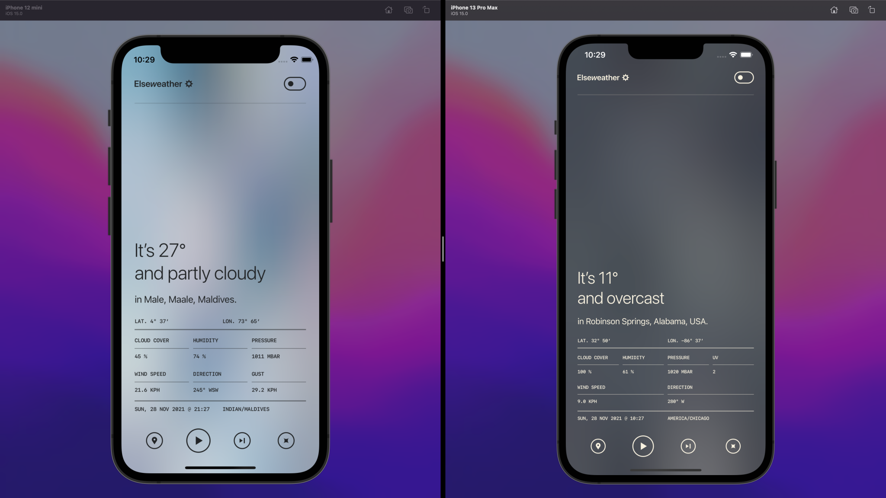

# Elseweather

App that displays current weather at a random location.

## Description

Elseweather was created as a student/research project with no practical purpose in mind. Made with SwiftUI, Apple’s latest framework and targets iOS 14.0 or higher. Feel free to use, modify, redistribute it without any restrictions.

<p>
    
</p>

## Installation

1. Get a free API key at [WeatherAPI.com](https://www.weatherapi.com)
2. Clone the repo
```sh
git clone https://github.com/jareksedy/Elseweather.git
```
3. Put your API key in `Config/Config.swift`
```swift
let apiKey = ""
```
4. Build, run, enjoy!

## Version History

### 1.0.5. Minor adaptations for light mode.
### 1.0.0. Initial release.
#### Features

* Metric and Imperial measurement units.
* Continuous mode (Play button).
* Support for system light and dark mode.

## License

Distributed under MIT License. See the LICENSE file for details.

## Acknowledgments

* Weather data provided by [WeatherAPI](https://www.weatherapi.com).
* World cities database by [SimpleMaps](https://simplemaps.com/data/world-cities).
* Elseweather utilizes BlurHash decoding algorithm by [Wolt](https://github.com/woltapp/blurhash).

## Contact

Drop me a line at jareksedy@icloud.com
